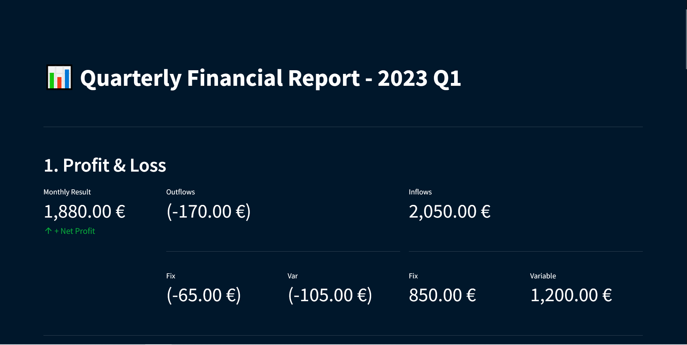
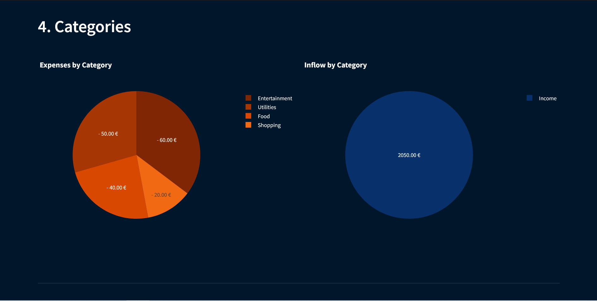

# Spending Dashboard

Every quarter I would sit down to **pull together all the different transactions** from financial instituations, **unify them into a format** and then try to make an **overview of different charts** to understand what has happened during the last quarter to my finances.

The last part of this whole process is tackled by this small project.

## Overview
A web-based dashboard that visualizes spending data, providing users with insights into their financial habits.



The dashboards consists of **five** sections

1. Profit & Loss

2. In- vs. Outflows

3. Fix vs. Var (for In- and Outflows)

4. Categories (for In- and Outflows)

5. Biggest Transactions

6. Notes
(see above)

## Features (mostly provided by _plotly_)
- Interactive charts and graphs for visualizing spending patterns.
- Filter and categorize spending data for detailed analysis.
- User-friendly interface with intuitive navigation.
- Responsive design for seamless usage on various devices.

## Getting Started
Follow these steps to set up and run the Spending Dashboard locally.

### Installation & Usage
1. Clone the repository: `git clone https://github.com/your-username/spending-dashboard.git`
2. Navigate to the project directory: `cd spending-dashboard`
3. Install dependencies: `python -m pip install -r requirements.txt`
4. Configure the user input (see [Configuration](#configuration))
5. Navigate into `reporting` directory: `cd reporting`
6. Run `streamlit`: `streamlit run streamlit.py`
7. Open web browser (might be done automatically by `streamlit`) at `http://localhost:8501/` (can differ, look at console output)

### Configuration
1. Edit the `config.json` file to customize dashboard settings.
    ```
    {
    "year": "2023",
    "quarter" : "Q1",
    "path_to_data": "../data/sample_data.csv",
    "notes": "This is a test note."
    }
    ```
2. Make sure your data adheres to the minimal requirements defined in `QuarterlyInputData` [here](./reporting/models.py#QuarterlyInputData) (this will also be checked by the application)
